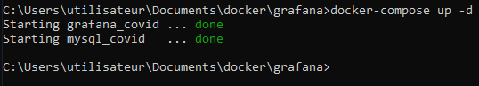
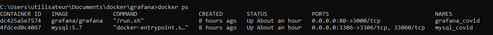

# Un conteneur pour grafana

Ce projet réalisé en binôme a pour but de développer sur un serveur Linux un dashboard Grafana proposant des graphiques sur la vaccination de la Covid-19 dans le monde.

## Traitement des données
Pour commencer nous avons traité les données mises à notre disposition:
* Suppression des colonnes qui ne nous semblaient pas "utilent" pour les graph que l'on voulait faire permettant ainsi d'alléger le fichier
    * iso_code : code du pays
    * id_vac : id de l'entrée dans la database
    * source_name : la source des données (ministère de la santé, agence gouvernementale, ... ) 
    * source_website : le site internet où l'on trouve l'information
* Le remplacement des valeurs NAN par des 0 pour une meilleure intégration 
* Convertion du fichier .csv et .sql

## Installation 

Dans un premier temps, installer Docker Desktop [lien](https://www.docker.com/products/docker-desktop)

Les installations de Grafana et MySql  se fait via Docker.

## Création du docker-compose

Pour faciliter la mise en place des containers , nous avons utilisé un fichier [docker-compose](/docker-compose.yml) qui contiendra les information nécessaires à leur création.

Ce fichier peut être lancé dans l'invit de commande avec un ``cd PATH`` pour se placer dans le même dossier que le docker-compose puis avec ``docker-compose up -d``

Cela va permettre de créer les 2 containers pour **MySQL** et **Grafana** et de les lancer.  

On peut vérifier que les containers sont bien lancés avec la commande ``docker ps``

## MySQL

Au lancement du docker-compose, le fichier SQL contenant les données est stoqué dans le dossier ``docker-entrypoint-initdb.d`` grâce au volume.

